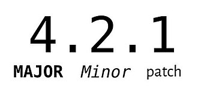

<!--
theme: gaia
class:
 - invert
headingDivider: 2 
paginate: true
-->

<!--
_class:
 - lead
 - invert
-->

# [Journey of Automation - Github, Galaxy, Fedora](https://spetrosi.github.io/release_automation_devconf2023)

[Pavel Cahyna](mailto:pcahyna@redhat.com), [Sergei Petrosian](mailto:spetrosi@redhat.com)

## Automation is more important than ever before in software project management

Being able to automate the low level, labor intensive parts of project management is critical. There are many tools in the Fedora and Github ecosystems that facilitate project management, such as GitHub Actions, Packit, and more. Learn how the Linux System Roles team leveraged these tools to perform:
* Automated Ansible role release and publish to Ansible Galaxy
* Automated Ansible collection build, publish and release to Galaxy
* Automated Fedora RPM build and publish with Packit
<!--
Comments for the slide for the presenters
For slies syntax examples use https://github.com/ralexander-phi/marp-to-pages/blob/main/README.md and https://github.com/spetrosi/jak_psat_moderni_ucebnice/blob/dev/README.md
-->

## Automated GitHub Releases

1. GitHub Action that we run manually when we need a new release
2. GitHub Action that runs daily and releases new content if any of the repositories have updates

## How We Use Conventional Commits

Format: `<type><!>: PR Title`

* **!** - **MAJOR** bump
* `feat` - **MINOR** bump
* `fix`, `ci`, `test`, etc. - **PATCH** bump

*feat: Support custom data and logs storage paths*

## Processing Conventional PR Titles

<!-- We have a GitHub action that we run when we want to create a new release. This action does the following: -->
1. Figure out the semantic version to use for the new tag
2. Build changelog based on PR types
  1. `feat:` -> *New Features*
  2. `fix:` -> *Bug Fixes
  3. else -> *Other Changes*
3. Pushes a new repository version and tag into GitHub

## Releasing Individual Roles

Each repository has a GitHub action that watches for new releases, and when one occurs, publishes the role into Ansible Galaxy.

## Publishing Collections

We have a cron-like GitHub action that runs daily and finds out if any of the role repositories has a new tag published.
If yes, the action converts the roles to a collection format and publishes the resulting collection to Galaxy.

## Automated RPM Release with Packit
