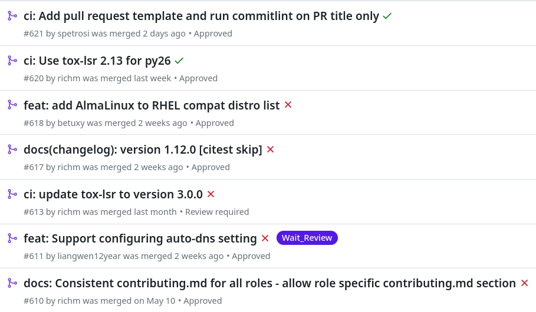

<!--
theme: gaia
class:
 - invert
headingDivider: 2 
paginate: true
-->

<!--
_class:
 - lead
 - invert
-->
<style>
{
  font-size: 30px
}
</style>

# Journey of Automation - Github, Galaxy, Fedora

[Sergei Petrosian](mailto:spetrosi@redhat.com), [Pavel Cahyna](mailto:pcahyna@redhat.com)

## Automation is more important than ever before in software project management

<!-- Being able to automate the low level, labor intensive, repetitive parts of project management is critical. There are many tools in the Fedora and Github ecosystems that facilitate project management, such as GitHub workflows, Packit, and more. -->

Learn how the [Linux System Roles](https://github.com/linux-system-roles/) team leverages automation:
1. Automated Ansible role release and publish to Ansible Galaxy
<!-- 2. Automated Ansible collection build, publish and release to Galaxy -->
2. Automated Fedora RPM build and publish with Packit
<!--
Comments for the slide for the presenters
For slies syntax examples use https://github.com/ralexander-phi/marp-to-pages/blob/main/README.md and https://github.com/spetrosi/jak_psat_moderni_ucebnice/blob/dev/README.md
-->

## Automated GitHub Releases

1. A [role-make-version-changelog.sh](https://github.com/linux-system-roles/auto-maintenance/blob/main/role-make-version-changelog.sh) script executed manually to update changelog in GitHub repository
    a. Identifies a new semantic version using conventional commits
    b. Generates changelog using conventional commits
    c. Creates a PR with updated changelog
2. Once the changelog PR is merged, a [changelog_to_tag.yml](https://github.com/linux-system-roles/network/blob/main/.github/workflows/changelog_to_tag.yml) GitHub workflow triggers and does two tasks:
    a. Tags and releases GitHub repository
    b. Publishes repository content to Ansible Galaxy
<!-- 3. Cron-like daily GitHub workflow that collects and publishes content from multiple repositories if any repository has an update -->

## Changelog Generation: Conventional Commits Format

Format:
`<type><!>: PR Title`


## Figure out the new semantic version


- **!** - **MAJOR** bump
- `feat` - **MINOR** bump
- `fix`, `ci`, `test`,… - **PATCH** bump

For example:
`feat!: User-specified mount point owner and permissions (#239)` - **MAJOR** bump
`feat: Add support for LVM RAID stripe size (#357)` - **MINOR** bump
`test: Add basic selinux_restore_dirs test` - **PATCH** bump

## Build changelog based on PR types

`feat:` -> **New Features**
`fix:` -> **Bug Fixes**
else -> **Other Changes**


## GitHub Release Process using Conventional PR Titles

1. A developer runs the [role-make-version-changelog.sh](https://github.com/linux-system-roles/auto-maintenance/blob/main/role-make-version-changelog.sh) script
2. This script collect merged PRs since last release
3. Using conventional commits format, identifies version and generates a new changelog
4. Pushes a PR with the updated changelog

## Creating Releases

PR merge triggers a [changelog_to_tag.yml](https://github.com/linux-system-roles/network/blob/main/.github/workflows/changelog_to_tag.yml) GitHub workflow that creates GitHub tag and release, and publishes repository content to Ansible Galaxy

```yaml
name: Tag, release, and publish role based on CHANGELOG.md push
on:
  push:
    branches:
      - main
    paths:
      - CHANGELOG.md
jobs:
      - name: Create tag...
      - name: Create Release...
      - name: Publish role to Galaxy...
```

## Automated RPM Release with Packit

[Packit Service](https://packit.dev/docs/guide/) proposes Fedora releases from GitHub releases

- triggered by GitHub release
- updates spec file (`Version`, `%changelog`)
- uploads Sources to lookaside
- opens Pagure PR with updates
- performs Koji build & Bodhi update after Pagure PR is merged

## Enabling Packit
<style scoped>
{
     font-size: 24px
}
</style>
Upstream (GitHub repo): create [`.packit.yaml`](https://github.com/linux-system-roles/auto-maintenance/blob/main/.packit.yaml)
```yaml
jobs:
  - job: propose_downstream
    trigger: release
    dist_git_branches:
      - fedora-all
```
Downstream (Fedora dist-git):  create [`.packit.yaml`](https://src.fedoraproject.org/rpms/linux-system-roles/blob/rawhide/f/.packit.yaml)
```yaml
jobs:
  - job: koji_build
    trigger: commit
    dist_git_branches:
      - fedora-all
  - job: bodhi_update
    trigger: commit
    dist_git_branches:
      - fedora-branched # rawhide updates are created automatically
```
## Caveats (1)
<style scoped>
{
     font-size: 22px
}
</style>

### Where to maintain the spec file?
If in GitHub repo, any Fedora changes will get overwritten.
Solution:
- keep spec file in Fedora dist-git repo
  - fetch it from there before creating the update
    ```yaml
    actions:
        post-upstream-clone:
          - "wget https://src.fedoraproject.org/rpms/linux-system-roles/raw/rawhide/f/linux-system-roles.spec -O linux-system-roles.spec"
    ```
    together with all the files that it `%include`s:
    ```yaml
          - "wget https://src.fedoraproject.org/rpms/linux-system-roles/raw/rawhide/f/extrasources.inc -O extrasources.inc"
    ```
  - or, configure Packit in Fedora dist-git instead of in GitHub repo
    - use `job: pull_from_downstream` instead of `job: propose_downstream`
## Caveats (2)
<style scoped>
{
     font-size: 24px
}
</style>

### How about RPM %changelog?

- by default, all Git commit message summaries in the GitHub repo used as the %changelog entry
- [`copy_upstream_release_description`](https://packit.dev/docs/configuration/#copy_upstream_release_description)
  uses the GitHub release description.

Contrary to [Fedora packaging guidelines](https://docs.fedoraproject.org/en-US/packaging-guidelines/manual-changelog/):
"They must never simply contain an entire copy of the source CHANGELOG entries."

Solution: custom changelog generator
```yaml
actions:
  changelog-entry:
  - echo "- Rebase to version ${PACKIT_PROJECT_VERSION}"
```
## Caveats (3)
<style scoped>
{
     font-size: 24px
}
</style>

### Multi-Source RPMs
Our linux-system-roles RPM assembled from many individual repositories

Need: multiple Source: tags in spec, update them if any source tarball changes, Packit to upload them to lookaside

- using a spec file generator to update Sources
  ```yaml
  actions:
    post-upstream-clone:
      - "./generate_spec_sources.py linux-system-roles.spec.in linux-system-roles.spec"
  ```
  ```
  # BEGIN AUTOGENERATED SOURCES
  ...
  Source24: %{archiveurl24}
  # END AUTOGENERATED SOURCES
  ```
- Packit now supports multi-source RPMs. If a Source is an URL, Packit uploads it to lookaside
  [https://github.com/packit/packit/pull/1778](https://github.com/packit/packit/pull/1778)

## Conclusion

This presentation is both a [website](https://spetrosi.github.io/release_automation_devconf2023) and a [README.md](https://github.com/spetrosi/release_automation_devconf2023/blob/main/README.md) deployed with [marp-to-pages](https://github.com/ralexander-phi/marp-to-pages) project.

# 🎉
<!--
_class:
 - lead
 - invert
-->
### Q&A

## References

[Linux System Roles GitHub](https://github.com/linux-system-roles/)
[Linux System Roles Ansible Galaxy collection](https://galaxy.ansible.com/fedora/linux_system_roles)
[role-make-version-changelog.sh script](https://github.com/linux-system-roles/auto-maintenance/blob/main/role-make-version-changelog.sh)
[changelog_to_tag.yml GitHub workflow](https://github.com/linux-system-roles/network/blob/main/.github/workflows/changelog_to_tag.yml)
[Resulting CHANGELOG.md](https://github.com/linux-system-roles/network/blob/main/CHANGELOG.md)
[Resulting GitHub releases](https://github.com/linux-system-roles/network/releases)
[.packit.yaml in GitHub repo](https://github.com/linux-system-roles/auto-maintenance/blob/main/.packit.yaml)
[.packit.yamlin Fedora dist-git](https://src.fedoraproject.org/rpms/linux-system-roles/blob/rawhide/f/.packit.yaml)
[Example PR opened by Packit](https://src.fedoraproject.org/rpms/linux-system-roles/pull-request/222#)
